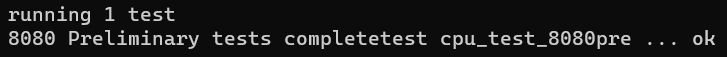

# emu-8080
An Intel 8080 emulator following the tutorial on [emulator101.com](http://emulator101.com/).


## Dependencies
In order to run this emulator, you will first need to install:
* [Rust](https://www.rust-lang.org/tools/install)
* [SDL2](https://www.libsdl.org/download-2.0.php) and [SDL2_mixer](https://www.libsdl.org/projects/SDL_mixer/)

## Games
To run a game, you will first need to "source" the files, then combine them into a `.bin` file.
Place these files in the root folder of the repository.

Implemented games/machines so far are:
* Space Invaders (`invaders.bin`)
* Boot Hill (`boothill.bin`)

Space Invaders is the only one with sound and a color screen overlay.

Other games should load and display on screen, but cannot be controlled.
(Each machine needs to have its inputs programmed individually)

### Controls
To exit the game, press Escape. To pause or unpause the game, press P.

Please view the game-specific controls [here](./CONTROLS.md).

## Running
To run the emulator, use the command:
```
cargo run --release <game_filename>
```

### Tests
Running tests requires Cargo nightly. (This is to enable mutation testing through `cargo mutagen`)

To run only the unit tests, use the command:
```
cargo test --lib
```

This emulator has been verified to pass against the main 4 CPU tests for the Intel 8080:
`TST8080`, `CPUTEST`, `8080PRE` and `8080EXM`. Files and descriptions for these tests can be found at
https://altairclone.com/downloads/cpu_tests/.

To run only the CPU test suite, first download the `.COM` files for these tests into a folder called `cpu_tests`.
Then use the command:
```
cargo test --test cpu_tests
```
Be warned that this will take a while to complete all the tests, about 20 minutes on my machine.

The output should be:





### Benchmarking
Also requires Cargo nightly.
```
cargo bench
```
